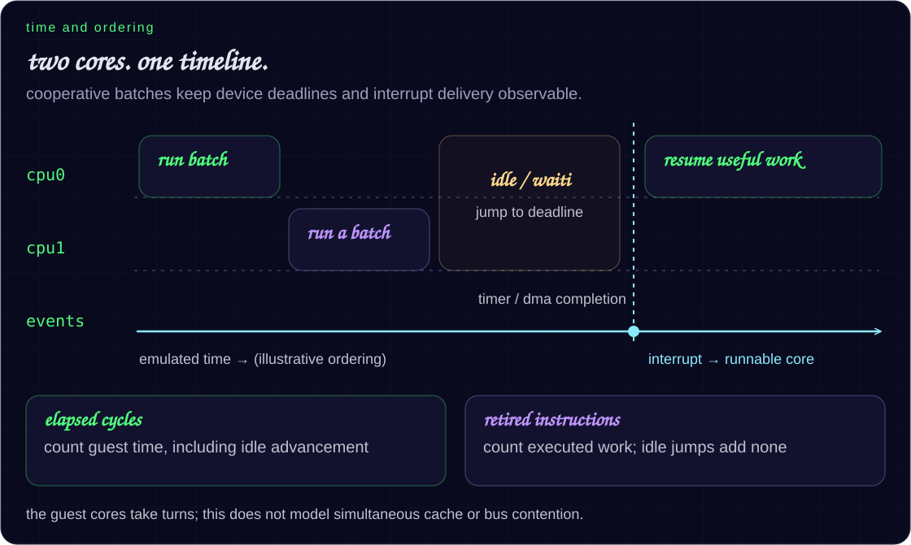

# how flexe fits together

one session, a target-described machine, and two ways to execute the same
firmware. start with the pictures; the source links are here when you need
to change something.

[what runs](docs/compatibility.md) ·
[hardware boundaries](docs/hardware-completeness.md) ·
[testing](docs/testing.md) · [performance](docs/performance.md)

## the ground rules

| rule | what it means in practice |
|---|---|
| target data describes the machine | addresses, core generation, register layouts, and wiring come from versioned descriptors |
| the interpreter defines cpu behavior | the jit shares architectural state and can decline a translation safely |
| one deterministic timeline | timers, dma, interrupts, sleep, and both cores preserve firmware-visible ordering |
| gaps stay visible | unknown mmio and service calls remain diagnostic, even when a fallback lets firmware continue |

esp32/lx6 and esp32-s3/lx7 are supported functional targets. cache timing,
bus contention, electrical/rf fidelity, and simultaneous host execution of
guest cores sit outside that support boundary.

## system composition

[`flexe_session_t`](src/flexe_session.h) owns the cpus, shared memory,
devices, hooks, scheduler, and host attachments. creation in
[`flexe_session.c`](src/flexe_session.c) follows a small sequence:

1. probe the image and select or verify its target.
2. allocate memory and load the optional matching official rom elf.
3. construct devices from target capabilities and descriptors.
4. load the app, seed its flash mmu, and supply any missing standalone-app boot state.
5. reset the cores and connect interrupts, timers, hooks, boards, and endpoints.
6. enable the native jit on supported hosts unless the caller disables it.

the session also handles cpu1 startup, batch scheduling, reset rebuilds,
and asynchronous wake.

## target data and board population

[`target_types.h`](src/target_types.h) is the small interface used by hot
cpu/memory headers. [`target.h`](src/target.h) declares the full descriptor;
[`target.c`](src/target.c) supplies the instances.

| descriptor data | consumers |
|---|---|
| image chip id, lx generation, core count, reset vectors | loader and cpu setup |
| physical backings, aliases, executable ranges, mmu geometry | memory and jit |
| capability bits and device register layouts | `periph_create()` and device models |
| interrupt sources, matrix signals, clocks, resets, dma ids | device connections |
| flash geometry and rom boot abi | application handoff |

device-owned extensions keep changing peripheral layouts out of the hot
`target.h` interface; [`touch_v2.h`](src/touch_v2.h) is an example.
keep new device descriptor types in their owning headers and attach them
through stable extension tags.

boards attach optional psram, displays, touch, storage, and other external
devices separately. a controller can serve a headless harness or a physical
board layout without depending on a firmware name or entry point.

## images, rom, and memory

| input or operation | behavior |
|---|---|
| standalone app | [`loader.c`](src/loader.c) supplies a minimal coherent partition/boot layout |
| merged factory image | keeps real partitions and flash bytes |
| official rom elf | [`rom_elf.c`](src/rom_elf.c) loads immutable code plus linker-described data/bss and resolves rom abi state |
| ordinary ram access | [`memory.c`](src/memory.c) uses a direct 4 kib page lookup and host load/store |
| device access | a memory miss enters registered page/range mmio handlers |
| code changes | flash writes and mmu remaps invalidate decoded and native code |

the loader validates chip and flash geometry, copies internal-memory segments,
and maps flash-backed segments through the target mmu. esp-reserved non-loaded
blocks affect parsing offsets but are never copied to guest address zero.

host backings cover sram, rom, flash instruction/data views, rtc memory,
and optional psram. mmio writes can preserve byte enables for fifos,
strobes, and write-one-to-clear registers. unmapped memory misses are
counted separately from unsupported accesses inside a known device.

software reset reloads original internal app segments while retaining
guest-modified flash. booting a different ota image remains unsupported.

## interpreter and jit

[`xtensa.c`](src/xtensa.c) defines windowed lx6/lx7 execution:
the 64-entry physical register file, windows, special/user registers,
exceptions, debug state, interrupts, compare timers, loops, floating point,
and separate elapsed-cycle/retired-instruction counters.

the interpreter predecodes executable memory and runs the firmware's own
window vectors by default. the optional window accelerator applies only to
validated canonical handlers and preserves their visible state.

[`jit.c`](src/jit.c) compiles hot basic blocks for arm64 and x86-64.
a target translation profile decides which code is eligible.

| correctness boundary | jit behavior |
|---|---|
| unsupported instruction or context | return to the interpreter |
| exact rom/service hook | stop translation at the host boundary |
| window and loop context | include architectural context in block keys |
| scheduler, timer, interrupt, debugger, or cycle budget | bound block chaining at safepoints |
| flash write or mmu remap | invalidate affected native code |
| `--jit-verify` | journal ram, replay eligible blocks, and compare architectural state |

mmio blocks are excluded from differential replay because reads/writes may
consume data or change a device. the emitters live in
[`jit_emit_arm64.h`](src/jit_emit_arm64.h) and
[`jit_emit_x64.h`](src/jit_emit_x64.h). other hosts use
[`jit_stub.c`](src/jit_stub.c) and the interpreter.
the aot tool in `tools/` is experimental and opt-in.

## time, interrupts, and two cores

the cores execute cooperatively in deterministic batches.
`flexe_session_post_batch()` starts cpu1 through the target boot contract,
alternates work, handles spinlock handoff, and reconciles both cores onto
one timeline.

| counter | counts |
|---|---|
| `insn_count` | guest instructions actually retired |
| `cycle_count` | elapsed emulated core cycles, including idle advancement |
| `virtual_time_us` | time skipped by functional waits and scheduler fast-forwarding |

both engines stop at a computed event horizon. devices expose their next
deadline and raise target interrupt sources through the interrupt matrix.
`WAITI` and idle execution may jump to useful work without gaining retired
instructions. sub-instruction races and simultaneous cache/bus contention
are outside this model.

## devices and host boundaries

[`peripherals.c`](src/peripherals.c) composes reusable target-described
devices. larger state machines live in focused modules such as `gpio.c`,
`gdma.c`, `timer_group.c`, `spi_mem.c`, `i2s_v2.c`, and `lcd_cam.c`.

a device owns its register/reset behavior, reserved-bit masks, clock gates,
completion events, interrupts, dma ownership/memory effects, and external
attachment API. fast mode often publishes a complete transaction rather than
each serial-clock edge. schedule edges when firmware-visible behavior needs them.

[`peripherals.h`](src/peripherals.h) exposes controller-level attachment
APIs for buses, storage, can, ethernet, audio, and other endpoints.
[`sandbox_input.h`](src/sandbox_input.h) and
[`sandbox_events.h`](src/sandbox_events.h) provide bounded input/event
messages for frontends. board devices consume those same boundaries.

## rom and service compatibility

[`rom_stubs.c`](src/rom_stubs.c) registers mask-rom and selected sdk/runtime
services at their abi boundary. resolution uses official rom symbols, app
elf symbols, stable abi data, or complete structural fingerprints.
an exact hook bitmap keeps dispatch cheap and prevents translation across hooks.

| mode | execution boundary |
|---|---|
| compatibility | selected freertos, display, wi-fi, bluetooth, vfs, and library services may be host-backed; guest callbacks and drivers still execute |
| native (`-N`) | the firmware runs its own freertos and relies more heavily on modeled hardware |

a successful service shim does not establish mmio hardware support.
tests and compatibility claims must keep that distinction explicit.

## reset, sleep, and retention

| transition | rebuilt or resumed | retained |
|---|---|---|
| system software reset | cpus, controllers, services, jit | live nor and host attachments; target-specific rtc, pad-hold, and external-memory state |
| app-cpu reset | cpu1 at a safe scheduler boundary | shared soc |
| light sleep | resume on the shared timeline | the existing machine |
| deep sleep | reset path with target wake cause | target-described rtc retention |

controller fifos and in-flight transactions do not survive a machine rebuild.
asynchronous gpio/touch input can wake a sleeping machine while both cores
retire no instructions.

## source map

| area | start here |
|---|---|
| machine and scheduling | `src/flexe_session.[ch]` |
| target geometry | `src/target.[ch]`, `src/target_types.h` |
| cpu and windows | `src/xtensa.[ch]`, `src/window_accel.c` |
| native translation | `src/jit.c`, `src/jit_emit_*.h` |
| memory, images, rom, xip | `src/memory.[ch]`, `src/loader.[ch]`, `src/rom_elf.[ch]`, `src/flash_mmu.[ch]` |
| devices | `src/peripherals.[ch]` and device modules |
| services | `src/*_stubs.[ch]`, `src/guest_call.[ch]`, `src/firmware_scan.[ch]` |
| board models | `src/spi_display.[ch]`, `src/axp192.[ch]`, `src/sx127x.[ch]`, `src/ublox_gps.[ch]` |
| cli and events | `src/main.c`, `src/sandbox_*.[ch]` |
| validation | `tests/`, `tests/fixtures/`, `tools/`, `scripts/` |

## adding something new

| change | where to put it | what to prove |
|---|---|---|
| target | descriptor geometry and reusable capabilities | every differing layout/connection; a descriptor alone does not establish execution support |
| device | owning module and device-owned extension | mmio, clock/reset, interrupt/dma, and controller-level host behavior |
| instruction | interpreter and disassembler first; jit second | semantics plus guarded native exits against the interpreter |
| service acceleration | symbols or complete structural validation | guest abi, time, interrupts, memory effects, and visible hook boundaries |

validation layers are unit tests, interpreter/jit comparisons (including
encoding-space sweeps), real arduino/esp-idf driver fixtures, sustained
production scenarios, and gcc/clang/sanitizer/cross-backend ci.
[the testing guide](docs/testing.md) has the commands.
