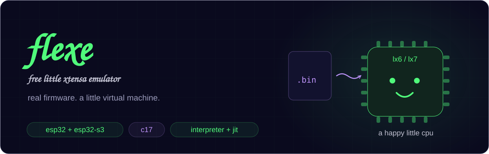
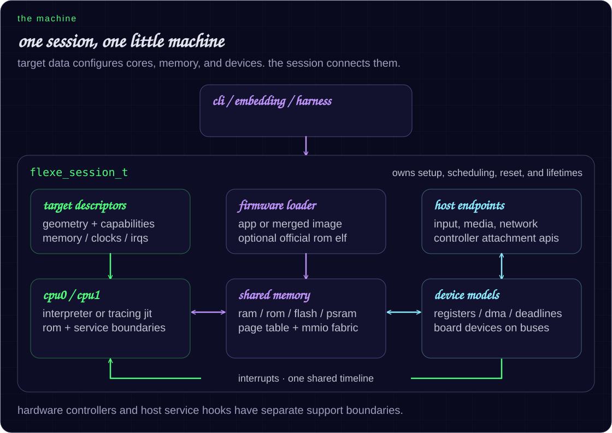

<p align="center">
  
</p>

<p align="center">
  <a href="https://levkropp.github.io/flexe/">the little website</a> ·
  <a href="docs/compatibility.md">what runs</a> ·
  <a href="ARCHITECTURE.md">how it works</a> ·
  <a href="docs/testing.md">testing</a> ·
  <a href="docs/performance.md">the numbers</a>
</p>

<a id="flexe"></a>

# hello, flexe

a free little xtensa emulator for esp32/lx6 and esp32-s3/lx7. written in c,
with a reference interpreter and tracing jit backends for arm64 and x86-64.

feed it unmodified esp-idf or arduino firmware. give it virtual peripherals,
a board, and some input. watch the firmware do useful work.

<a id="highlights"></a>

## what's in the box

| a little piece | what it does |
|---|---|
| real firmware | bruce, marauder, meshtastic, nerdminer, openhasp, tasmota, and wled have scripted scenarios in both engines |
| a speedy core | register windows, integer and floating-point execution, loops, exceptions, and interrupts; hot code gets a native jit |
| a virtual board | shared memory, flash/mmu, optional psram, two cores, and target-described peripherals |
| things to interact with | display and touch, storage, serial, buses, audio, gpio, and host-backed network services |
| checks that matter | cpu differential tests, stock-driver fixtures, firmware interactions, and matching output digests |

esp32 and esp32-s3 are supported **functional** targets. timing, electrical,
and rf limits still apply; the [hardware matrix](docs/hardware-completeness.md)
tracks the exact boundary. the two cores take turns on one shared timeline.

<a id="build"></a>

## give it a spin

you'll need a c17 compiler, cmake, openssl, zlib, and pthreads.

```sh
git clone https://github.com/levkropp/flexe.git
cd flexe
cmake -S . -B build
cmake --build build --target xtensa-emu -j

# jit is on by default on arm64 and x86-64
./build/xtensa-emu firmware.bin

# symbols make debugging and service hooks more useful
./build/xtensa-emu -s firmware.elf -c 10000000 firmware.bin
```

<a id="run-firmware"></a>

for esp32-s3, use the firmware's own freertos and a matching official rom elf:

```sh
./build/xtensa-emu --target esp32s3 -N \
  -R /path/to/esp32s3_rev0_rom.elf firmware.bin
```

roms and production firmware are supplied separately.
[the compatibility guide](docs/compatibility.md#target-selection) explains
target detection, rom requirements, and optional psram.

<details>
<summary>build notes, including macos</summary>

with homebrew openssl:

```sh
cmake -S . -B build -DOPENSSL_ROOT_DIR="$(brew --prefix openssl@3)"
cmake --build build --target xtensa-emu -j
```

release builds use lto and host-native tuning. use `-DNATIVE_ARCH=OFF` for
portable binaries, `-DFLEXE_LTO=OFF` for faster edit/test links, or
`-DFLEXE_CCACHE=OFF` to disable automatic compiler caching.

s3 ethernet host forwarding additionally needs libslirp 4.9+.
test and fixture runners are built separately when their scripts need them.

</details>

<a id="architecture"></a>

## meet the machine



a session owns the machine. target descriptors choose its layout; the
interpreter defines cpu behavior; the jit accelerates eligible hot blocks.
board devices and host endpoints attach through controller APIs.

[walk through the architecture →](ARCHITECTURE.md)

<a id="production-status"></a>

## what runs?

the classic corpus covers seven firmware families, including display/touch,
serial, storage, network, radio-service, and led scenarios. s3 has its own
pinned production and stock-driver gates.

a pass belongs to a **specific image and scenario**. a service-backed network
workflow and a modeled hardware controller have different support boundaries.

[see versions, scenarios, and remaining gaps →](docs/compatibility.md)

## a few useful switches

| switch | what it's for |
|---|---|
| `--no-jit` | compare with the interpreter |
| `--jit-stats` / `--jit-verify` | inspect native coverage / compare replayable blocks |
| `-s ELF` / `-R ROM_ELF` | load application symbols / official mask-rom code and data |
| `--efuse BLOB` | override s3 mac and chip revision from a 336-byte efuse blob |
| `--strap-mode HEX` | raw strap sample for rom boot selection (`0x07` = s3 uart0 download) |
| `--uart-tcp HOST:PORT` | bridge uart0 to a tcp server (esptool `socket://` transport) |
| `--control-tcp HOST:PORT` | host control channel: reset, erase/write flash, ping |
| `--ble-hci tcp:HOST:PORT` | forward s3 NimBLE HCI to an external controller (needs `-s ELF`) |
| `--strict-mmio` | fail on unsupported peripheral accesses while keeping the jit enabled |
| `--unhandled-report` | attribute unsupported accesses to registers and guest pcs in the interpreter |
| `--sandbox-events` | exchange peripheral events and host input as ndjson |
| `--usb-console` | use the native usb serial/jtag console |
| `-c N` / `-b ADDR` | set a cycle budget / breakpoint |
| `-T` / `-m ADDR[:LEN]` | trace instructions / dump memory |
| `-q` | suppress emulator diagnostics |

<a id="test"></a>

## keep it honest

```sh
cmake --build build --target xtensa-tests -j
./scripts/run-unit-tests.sh
./scripts/test-fixtures.sh spi-master i2c-wire
FLEXE_ROMS=/path/to/roms ./scripts/check-firmware.sh
```

[testing](docs/testing.md) covers focused suites, stock drivers, sanitizer
builds, and production gates.

<a id="performance"></a>

## how fast?

on the documented apple-silicon runs, the repeated classic wled gate measured
**1.482× interpreted / 3.522× jit**. the s3 wled gate measured
**1.34–1.49× / 2.29–2.43×**, with exact frame parity.

those are workload and host measurements. real-time factor measures guest
time; retired mips measures executed instructions. idle jumps count only
toward time.

against the official [esp-emulator](https://github.com/espressif/esp-emulator)
0.48.0 on the same s3 images and host, a sustained 1.21-billion-instruction
compute loop finished in **0.737 s jit / 8.900 s interpreted** vs **13.906 s**
for esp-emu — identical `BURN_DONE` checksums everywhere, 99.6% of flexe's
instructions retired natively. short boot-only runs tie; ten seconds of
freertos sleep take ~0.1 s here against ~10 s there, because idle time jumps
to the next deadline instead of pacing wall clock.

[dated results and reproducible commands →](docs/performance.md)

## flexe and esp-emulator

espressif now ships an official [esp-emulator](https://github.com/espressif/esp-emulator)
(rust, beta). it distributes prebuilt `esp-emu` binaries plus a browser/wasm
build, with default rom elfs embedded. the overlap with flexe is esp32-s3 only;
the two projects cover different chips and different depth.

| | flexe | esp-emulator |
|---|---|---|
| targets | esp32/lx6 and esp32-s3/lx7 | esp32-c3/c5/c6/h2/p4/s3/s31 (no classic esp32) |
| source | c, mit, build from source; interpreter + arm64/x86-64 tracing jit with `--jit-verify` parity | rust core distributed as prebuilt release + wasm; repo holds installer, docs, tools, `test_apps` |
| cpu/rom | common windowed lx6/lx7 profile; official rom elf supplied separately via `-R` | rv32imac/fc + lx7 s3, pmp/pma and apm/tee/pms enforcement; default rom elfs embedded, `--rom` to override |
| peripherals/boards | deep wired + board matrix: display/touch, sd/mmc, i2s, lcd-cam/camera, twai, adc, touch v2, rmt, ledc, pcnt, mcpwm, aes/sha/rsa, sleep/wake, optional s3 psram; scripted bruce/marauder/meshtastic/nerdminer/openhasp/tasmota/wled + agon vdp gates | documented uart, usb-serial-jtag, gpio, systimer, timer groups, plic/clic, efuse, spi flash (1–128 mb, 32-bit addr), gdma, gp-spi, rmt, ledc, pcnt, mcpwm, i2c + eeprom slave, watchdogs |
| network/radio/crypto | host-backed lwip socket bridge (+ libslirp ethernet hostfwd on s3) and controller bootstrap; wi-fi/ble stay service shims, no rf/phy claim | soft ap (wpa2-psk, wpa3-sae, enterprise via radius), user/tap/vmnet backends with dhcp/dns/mdns/ipv6/`hostfwd`/matter nat, openeth + p4 gmac, ble via bumble/physical hci, two-node thread mesh, aes/sha/rsa/ecc/hmac/ds/xts/ecdsa/key-manager |
| workflow | `--strict-mmio` / `--unhandled-report`, checkpoints, `--sandbox-events` ndjson, instruction/window/call traces, `--efuse` revision blobs, `--uart-tcp`/`--control-tcp` bridges | `socket://` esptool/espefuse + `--control-tcp`, `--efuse` revision blobs, `--gdb` stub, `--trace` perfetto timeline, browser dashboard |

use esp-emulator for risc-v chips, real wi-fi/ble/thread networking depth,
flashing/debugging workflows, and browser runs. use flexe for classic esp32 at
all, for s3 wired-peripheral/board depth with interpreter/jit agreement, and
for open-source c-level cpu/device work. both boot the real mask rom; flexe
requires the matching official rom elf as an external input.

## license

mit licensed. made with excessive respect for a little cpu.
