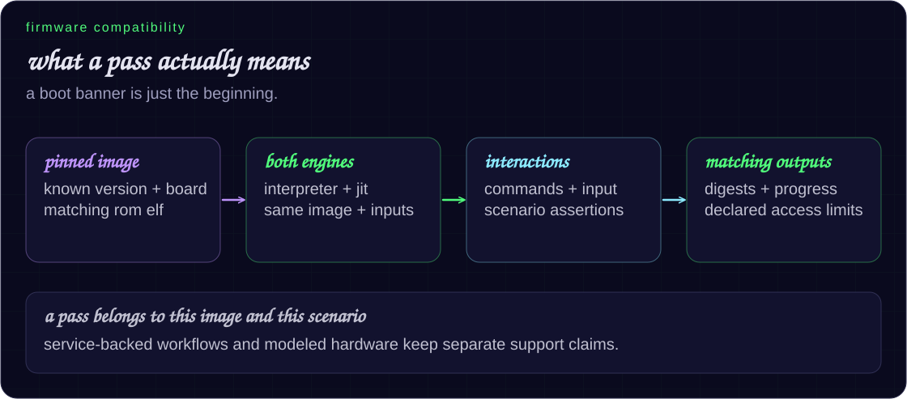

# what runs on flexe?

a pass means a pinned firmware image keeps doing useful work, responds through
modeled hardware or service boundaries, and produces matching results in the
interpreter and jit. the scenario defines the claim.



[current corpus](#current-corpus) · [s3 workflows](#esp32-s3-workflows) ·
[run a check](#run-a-check) · [target setup](#target-selection) ·
[hardware limits](#where-the-boundaries-are)

## current corpus

these classic esp32 images pass their scripted scenarios in **both engines**.
the table records coverage for those versions, rather than every feature
each firmware offers.

| firmware / board | pinned version | what to keep in mind |
|---|---|---|
| marauder / cyd 2432s028 2usb | 1.12.1 | official esp32 rom elf required |
| marauder / cyd | 1.14.3 | no remaining gap in the scripted scenario |
| marauder / cyd 2432s028 | 1.15.1 | no remaining gap in the scripted scenario |
| marauder / 3.5-inch and guition variants | 1.14.3 | no remaining gap in the scripted scenario |
| nerdminer | 1.8.3 | no remaining gap in the scripted scenario |
| bruce / cyd 2432s028 | 1.16.1 | official rom elf required; expand radio interactions |
| meshtastic / t-beam | 2.7.26 | official rom elf required |
| openhasp / lanbon l8 | 0.7.0-rc13 | expand ft6336 touch and http/mqtt interactions |
| tasmota | 15.6.0 | expand mqtt and device drivers |
| wled | 16.0.1 | expand http, ddp, and e1.31 scenarios |

firmware and rom images are supplied separately. recheck when an upstream
release changes.

### agon light / fabgl end-to-end regression

[Agon VDP 2.16.0](https://github.com/AgonPlatform/agon-vdp/releases/tag/v2.16.0)
has a separate native end-to-end VDP gate:

```sh
cmake --build build --target flexe-agon-vdp-test -j
AGON_VDP_BIN=/path/to/firmware.bin ./scripts/check-agon-vdp.sh
```

The gate pins the release application's SHA-256 to
`b807beef35823b13a0a056f11b7464cd1b1c6356dce0e4098b78ebe059ded35f`.
It runs native FreeRTOS without an ELF, application symbol hooks, or guest
memory patches. A UART2 peer sends the MOS handshake and VDU commands; the
firmware itself parses them and runs FabGL's drawing and interrupt code.
Both engines must return the exact handshake, mode information, character
query (`F`), and pixel queries (red/blue). The gate decodes raw I2S1 LCD DMA
scanout using its H/V sync bits and verifies:

- 640x480 mode 0: red background with white `FLEXE` text.
- A real VDU mode switch to 320x240 mode 8: blue background with the same text.
- Stable complete frames, pinned pixel hashes, and matching UART output.
- Continued scanout through a configurable soak, with frame count consistent
  with the programmed pixel clock, including blanking and double scan.
- A native I2S0/DAC square wave requested through VDU audio commands: 1024 Hz
  for 500 ms, followed by silence, with the expected audio acknowledgment.
- Native UART0 serial-console input produces the correct UART2 keyboard packet.
- Zero unsupported MMIO, unregistered ROM calls, or unmapped accesses; the
  JIT must retire native instructions during the soak.

Set `ARTIFACTS=/path/to/output` to retain PPM captures, the captured DAC tone as
`tone.wav`, and a JSON results file.
The matching release map supplies only a diagnostic `panic_abort` breakpoint;
success depends on the observed UART and VGA behavior.

This catches an internal analog-I2C ROM-stub defect: writes were discarded
and reads always returned zero, leaving FabGL in the APLL calibration loop.
Byte and masked register accesses now retain state, and the APLL reset/start
sequence completes calibration functionally. APLL SDM/divider registers now
drive the shared I2S clock source, and LCD DMA uses its parallel word clock
instead of PCM stereo timing. Analog lock timing is not modeled.

There is also a [full-machine gate](testing.md#agon-mos-and-bbc-basic) using the
upstream eZ80 emulator as a separate process, with pinned Agon Platform MOS
3.0.2 and BBC BASIC images. The native VDP's UART and decoded VSync connect to
the eZ80 side. MOS boots, runs shell commands, reads a file, loads BBC BASIC,
and runs a program that changes video mode, waits for vertical blank, and
prints arithmetic and loop results. Both engines must produce the same pinned
final VGA pixels.

Keyboard input in these gates uses Agon's supported serial-console mode.
**Physical PS/2 keyboard/mouse input is not supported:** FabGL uses the classic
ULP FSM coprocessor, which Flexe does not yet execute. The eZ80 peer uses its
upstream host filesystem service for SD access; this does not validate ESP32
SD hardware. Other video modes, audio features beyond the tested square wave,
and arbitrary applications still need coverage. The release still logs a
core-1 watchdog-removal warning.
The approximately 40,000-cycle `panic_abort` reported in
[issue #2](https://github.com/levkropp/flexe/issues/2) was not reproduced with
this release or the locally built current source; identifying that failure
still requires the reporter's exact image and command line.

## curated cyd scenarios

`scripts/check-stock-roms.sh` checks completion, meaningful i/o, scenario
effects, and matching output digests. known official image hashes also have
pinned output digests.

| firmware | interactions covered |
|---|---|
| bruce | ili9341 rendering, gpio-bit-banged xpt2046 menu navigation, gpio36 penirq, sd initialization and fat |
| marauder | ili9341/xpt2046 navigation, uart0 commands, independent uart2 gps, sd/filesystem, wi-fi receive/raw transmit boundaries, ble scan/advertising |
| meshtastic | axp192 power rails, sx1276 discovery/init, serial configuration, encrypted lora tx/loopback rx through radiolib interrupts, nimble sync/advertising, u-blox ubx/nmea position and time |
| nerdminer | wi-fi association/event delivery, captive-portal http/dns, host-backed pool networking, mining task execution |
| openhasp | lanbon l8 st7789v on cs22/dc21/sclk19, host tcp/telnet, three jsonl commands through dispatcher/lvgl to a deterministic framebuffer |
| tasmota | access-point startup, production http `Status 0`, berry commands toggling gpio4 |
| wled | access-point startup, udp port 21324, host dnrgb input parsed by firmware, 30-pixel grb output through rmt refill interrupts to a 40 mhz ws2812 waveform |

wi-fi/bluetooth service interactions in this table retain their service
boundaries. see the [hardware matrix](hardware-completeness.md#current-capability-matrix)
before treating them as silicon or rf support.

## esp32-s3 workflows

s3/lx7 is a supported functional target with interpreter and jit execution.
its production and stock-driver gates have their own pinned inputs.

| gate | demonstrated behavior |
|---|---|
| `check-s3-nerdminer-portal.sh` | portal configuration, spiffs save, software restart, and reload; host-backed socket service |
| `check-s3-marauder.sh` | official 1.16.0 multiboard image, native bluetooth/wi-fi initialization, absent-gps probe, injected `help`, next prompt, nonzero jit retirement |
| `check-s3-wled-rmt.sh` | pinned 16.0.1 image; matching completed led frames and final cpu/time state, nonzero jit retirement |
| `check-s3-wled-http.sh` | matching source-build image/elf; native lwip/ethernet web ui, json state change, readback; libslirp 4.9+ and `jq` required |
| stock arduino and esp-idf gates | native drivers exercise buses, timers, gpio, dma, audio, camera, adc, touch, crypto, storage, and sleep/wake within their declared scope |

the current nerdminer full replay and wled unsupported-mmio audit require
zero unsupported sites. older filesystem-only milestones had thousands of
unhandled accesses; they do not describe the current full replay.

[exact s3 artifacts and hardware coverage →](hardware-completeness.md)
[driver gate commands →](testing.md#compiled-firmware-hardware-gates)

## run a check

### a known production scenario

```sh
BRUCE_BIN=/path/to/bruce.bin \
MARAUDER_BIN=/path/to/marauder.bin \
MESHTASTIC_BIN=/path/to/meshtastic.bin \
NERDMINER_BIN=/path/to/nerdminer.bin \
OPENHASP_BIN=/path/to/openhasp.bin \
TASMOTA_BIN=/path/to/tasmota32.bin \
WLED_BIN=/path/to/wled.bin \
FLEXE_ROM_ELF=/path/to/esp32_rev300_rom.elf \
./scripts/check-stock-roms.sh
```

additional positional images use the marauder profile and still require
both engines to agree.

<a id="arbitrary-firmware-corpus"></a>

### an arbitrary firmware corpus

```sh
FLEXE_ROMS=/path/to/corpus ./scripts/check-firmware.sh
```

`scripts/check-firmware.sh` accepts positional `.bin` files or files directly
under `FLEXE_ROMS`. each engine must:

- reach the virtual-time budget without trapping or stopping early;
- retire enough instructions to demonstrate useful execution;
- avoid unhandled mmio and unregistered rom calls;
- stay within the unmapped-memory limit and finish at a fetchable pc;
- produce the same normalized uart digest.

`BATCH` defaults to 10,000; `MAX_UNMAPPED` defaults to 1,000.
this generic progress gate does not establish all board interactions.

## target selection

the image's chip id and revision bounds select the machine.

| option | use |
|---|---|
| `--target auto` | default: detect the target |
| `--target esp32` / `--target esp32s3` | assert a target, useful in ci |
| `-R ROM_ELF` | load the official matching mask-rom code and data |
| `--efuse BLOB` | load a 336-byte efuse blob overriding s3 mac and chip revision (default: revision-0 profile) |
| `-s firmware.elf` | load application symbols for debugging and symbol-based services |
| `-N` | run the firmware's native freertos; use for s3 |
| `--psram ap-8m-opi` | opt into an 8 mib aps6408l-3obmx octal psram on s3 cs1 |
| `--usb-console` | use native usb serial/jtag output instead of uart0 |

```sh
# classic images that need mask-rom data
./build/xtensa-emu -R /path/to/esp32_rev300_rom.elf firmware.bin

# s3 native freertos with the matching rom
./build/xtensa-emu --target esp32s3 -N \
  -R /path/to/esp32s3_rev0_rom.elf firmware.bin
```

both rom runners accept `--rom-elf`; `FLEXE_ROM_ELF` supplies the classic
runner default. s3 gate scripts use `S3_ROM_ELF`.
official rom binaries are not copied into the repository.

hardware-facing hooks retain priority; other mask-rom calls execute the
loaded instructions. native translation uses target descriptors and exact
hook membership, rather than firmware names or pc lists.

## where the boundaries are

| area | supported boundary | outside that claim |
|---|---|---|
| cpu and jit | common windowed lx6/lx7 execution; unsupported translation falls back to the interpreter | cycle/cache accuracy |
| two cores | shared memory, interrupts, and deterministic batches on one timeline | simultaneous host execution and sub-instruction contention |
| flash | image-declared capacity, real merged partitions, nor read/program/erase, mmu mapping, session reset persistence | wear, interrupted-write power behavior, alternate ota-slot boot |
| optional s3 psram | profiled 8 mib array and mode registers, cache-mmu mapping, reset retention | calibrated dqs/refresh timing and other device profiles |
| peripheral drivers | register, dma, interrupt, and host-endpoint behavior demonstrated by each gate | all modes, physical wires, and calibrated latency |
| network/radio workflows | declared controller and host-service boundaries | rf/phy or general wi-fi/bluetooth equivalence |
| reset and sleep | target-specific retention, modeled wake sources, explicit reset behavior | all physical reset domains, brownout/ulp, or electrical transitions |

flash can grow up to 16 mib on classic esp32 and 128 mib on s3. guest writes
survive a session reset; they are not automatically saved to the input
`.bin` or retained across a new process.

for register details, timings, algorithms, exact hashes, and per-device gaps:

- [hardware-completeness matrix](hardware-completeness.md#current-capability-matrix)
- [peripheral implementation notes](peripheral-notes.md)
- [architecture and extension rules](../ARCHITECTURE.md)

## architectural register windows

the firmware's own overflow/underflow vectors run by default. that keeps
`setjmp`/`longjmp`, dynamic stacks, callback frames, and wrapped register
files on the hardware abi save areas.

<details>
<summary>legacy diagnostic switches</summary>

`FLEXE_WINDOW_VECTORS=0` selects the synthesized spill/fill path.
`FLEXE_SHADOWFILL=1` enables the old shadow-record restore shortcut.
both shortcuts are off by default.

</details>

## firmware-specific hooks

address-based wi-fi/bluetooth hooks require verified image fingerprints and
entry points checked against a symbol-bearing build from the same sdk/core.
use `build/xt-dis -a ADDR -n LEN firmware.bin` to inspect a stripped image.

the [implementation notes](peripheral-notes.md#execution-acceleration)
also describe structural critical-section acceleration and its fallback rules.
